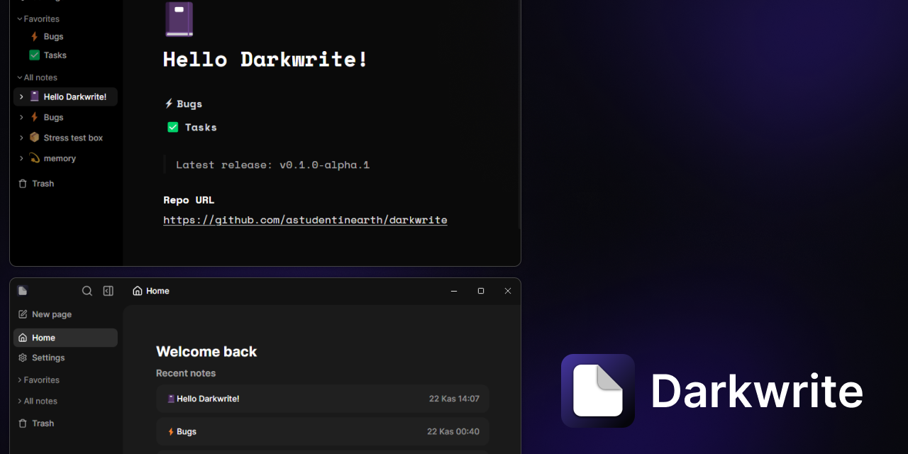

    
    
    
    
    

<strong>

    <a href="https://twitter.com/codingwithburak">Follow on Twitter</a> -
    <a href="https://github.com/astudentinearth/darkwrite/releases">Download Darkwrite</a> -
    <a href="https://github.com/astudentinearth/darkwrite/issues">Report bugs</a>

</strong>

# 📓Notes and todo, the way you want.

✒️ Darkwrite is a simple and easy way to organize your notes and todos. It was developed with the user in mind, where personalization plays a key role.

🛠️ Darkwrite is currently in alpha, basic features are available, however bugs are likely to happen and there is still a lot to work on. Head over to the [releases page](https://github.com/astudentinearth/darkwrite/releases) to get started.

⭐Star this repository to know when we release new updates.

## 🖊️ Easy to use and rich editor

🖋️ Unleash the power of a rich editor which supports formatting, headings, todo lists, numbered lists, links and much more.

## 🖌️ Make it yours.

🎨 Choose from the selection of included themes - or create your own. Say goodbye to the boring light and dark themes.  
✒️ Pick the fonts you like. You can change the default styles for your notes or choose a font you like only for one specific note. You can also change the user interface font and everything else will follow suit.

## 🔒 Open and private.

👨‍💻 Darkwrite's source code is right here. It does not collect any of your data. All your notes are stored locally on your device.  
📦 You are never locked in. Export all your notes as HTML files, and you can use them anywhere else. Need to backup your data? No problem. Get an archive with just one click and restore them later if you need it.

## Docs

-   [Building Darkwrite](docs/BUILDING.md)
-   [Development docs](docs/DEVELOPMENT.md)

For everything else, see [the docs folder](docs)

## License

Darkwrite is free and open source, licensed under GNU Affero General Public License, version 3 or any later version at your option.  
Licenses for 3rd party packages used to make Darkwrite possible can be found [here.](https://github.com/astudentinearth/darkwrite/blob/dev/packages/app-desktop/THIRDPARTY.txt)
