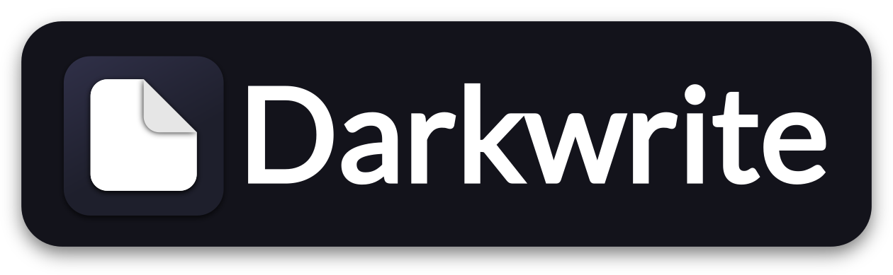

    
    
    
    
    
    
    
    

# Notes and todo, the way you want.
[Follow me on Twitter](https://twitter.com/codingwithburak)  
Darkwrite is a simple and easy way to organize your notes and todos. It was developed with the user in mind, where personalization plays a key role. 
Darkwrite is currently in alpha, basic features are available, however bugs are likely to happen and there is still a lot to work on. To download the alpha, go to the [releases page.](https://github.com/astudentinearth/darkwrite/releases).  
Star this repository to know when we release new updates.
## Easy to use and rich editor
Darkwrite features a rich editor which supports formatting, headings, todo lists, numbered lists, links and much more.

## Themes
Darkwrite supports custom themes, and comes with a selection of them by default.

## Fonts
Darkwrite lets you use the fonts you wish. You can change the user interface font; sans, serif and monospace fonts for your notes; or choose custom fonts on a per-note basis.

## Docs 
-    [Building Darkwrite](docs/BUILDING.md)  
-    [Development docs](docs/DEVELOPMENT.md)
  
For everything else, see [the docs folder](docs)

## License
Darkwrite is free and open source, licensed under GNU Affero General Public License, version 3 or any later version at your option.  
Licenses for 3rd party packages used to make Darkwrite possible can be found [here.](https://github.com/astudentinearth/darkwrite/blob/dev/packages/app-desktop/THIRDPARTY.txt)
