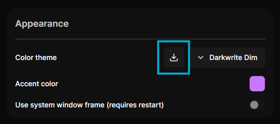

# Create your own theme

### 1. Copy the template below to a new file

```json
{
    "id": "my-own-theme",
    "name": "Custom Theme",
    "foreground": "0 0% 100%",
    "background1": "120 50% 50%",
    "background2": "0 0% 4%",
    "background3": "0 0% 6%",
    "cardBackground": "0 0% 7%",
    "cardForeground": "0 0% 94%",
    "popoverBackground": "0 0% 3%",
    "popoverForeground": "0 0% 94%",
    "secondaryBackground": "0 0% 10%",
    "secondaryForeground": "0 0% 100%",
    "mutedBackground": "0 0% 10%",
    "mutedForeground": "0 0% 89%",
    "destructiveBackground": "0 51% 55%",
    "destructiveForeground": "210 40% 98%",
    "disabled": "0 0% 16%",
    "border": "0 0% 14%",
    "focusRing": "212.7 26.8% 50%",
    "star": "50 97% 63%",
    "mode": "dark"
}
```

### 2. Change the `id` field to something unique, like an UUID.

### 3. Choose a name for your theme.

### 4. Tweak the colors to your liking.

> [!NOTE]
> You must define your colors in HSL format, without using commas. They will be assigned to CSS variables when Darkwrite is running.

### 5. Set the `mode` field appropriately.

If your theme is for dark mode, set it to `"dark"`, otherwise set it to `"light"`. This is required for compatibility reasons.

### 6. Save the file

Save it somewhere easily accessible like your desktop, but make sure the file extension is `.json`. For example, save it as `my theme.json`

### 7. Import your theme

Open Darkwrite, choose **Settings** from the sidebar. Under the **Appearance** category, click on the button with the arrow as shown below:



Choose the file you saved earlier.

### 8. Apply your theme

Select your theme from the theme menu to apply it. Enjoy your very own theme🖌️🎨

## Where can I find my theme files?

Your themes are stored in `<userDataDir>/darkwrite-data/themes/`, where `<userDataDir>` is the app data directory determined by your OS. You can easily get there by choosing **Tools > Open data directory** from Darkwrite's menu. (click the Darkwrite logo on the top left of the window)
